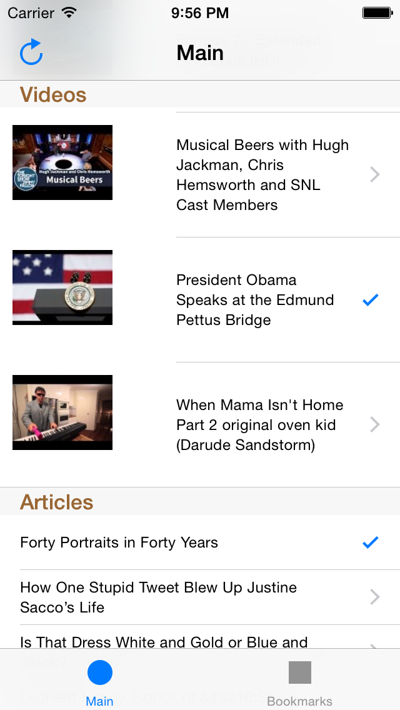

# Screenshot

# Code challenge overview

This is a project that was created as a result of a code challenge.  The originator specifically mentioned the following:

- This is a long challenge on purpose.
- The project does not need to be completely finished or working perfectly.
- The project was to be judged on coding style and the approach to the problem.

I decided to submit what was available after two days of work.    I got to everything except the Progress section in the first tab mentioned below.

# Challenge details

In the source directory, please create a new iOS project.  Create a two-tab application:

1st TAB:
Create a sectioned table with the following views under each header:

1. HEADER NAME: Progress
Gets “steps taken” data from HealthKit and presents it to you in a pretty and coherent way in animated graphs using either Core Animation or a third party animation framework (e.g. Facebook POP) and displays encouraging messages based on level of activity. If there’s no data recorded on HealthKit, enable tracking and record some data.

2. HEADER NAME: Videos
Pull videos from a third party API. Display the video thumbnail previews + titles in a list. Tapping the video thumbnail should play the video. Should be able to bookmark videos.

3. HEADER NAME: Articles
Pull articles from a third party API. Display the article titles in a list. Tapping an article title opens the article. Should be able to bookmark articles.

2nd TAB: Bookmarked Content

Should display a list of all bookmarked content. This list of bookmarked content should be locally persisted with Core Data and bookmarked content should be reflected in the 1st tab (e.g the articles and videos should have an indicator of being bookmarked).

The app should also handle no/bad network conditions appropriately from a UI perspective.

